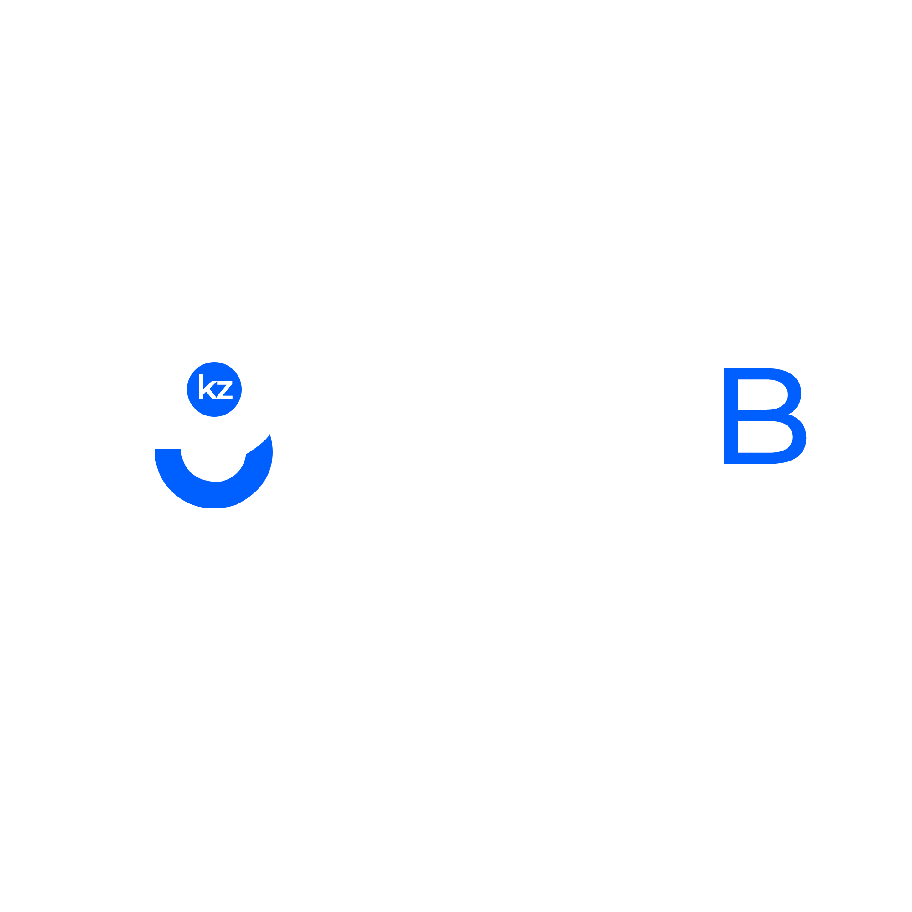
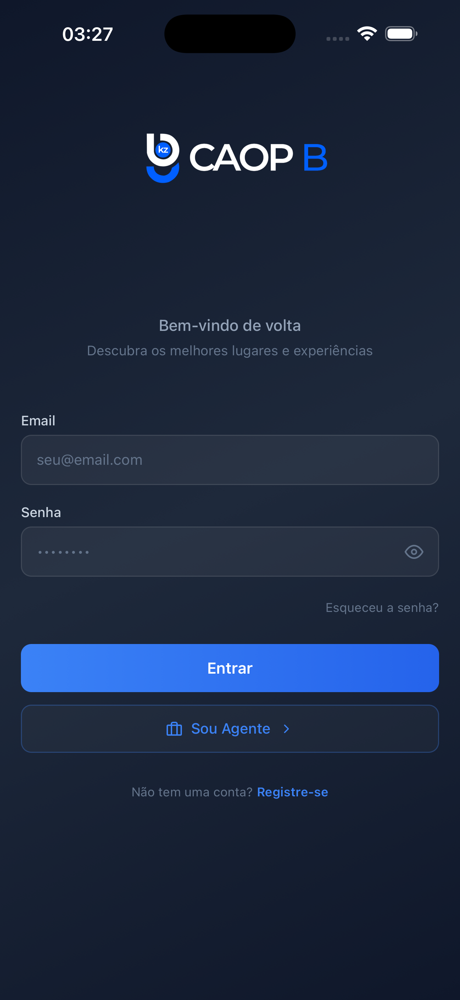
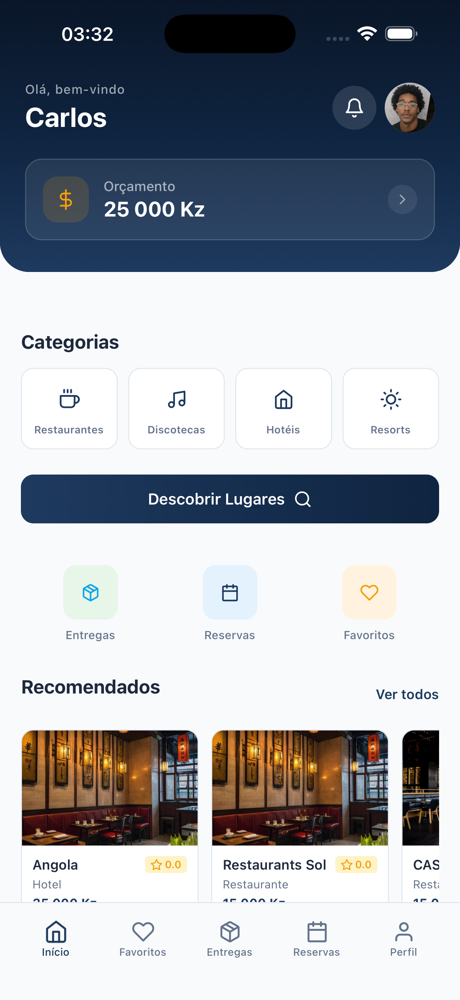
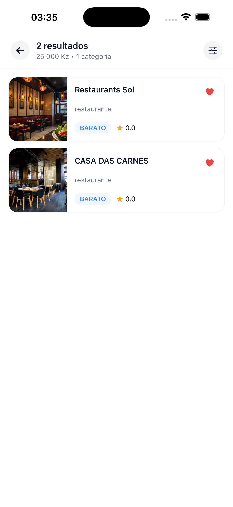
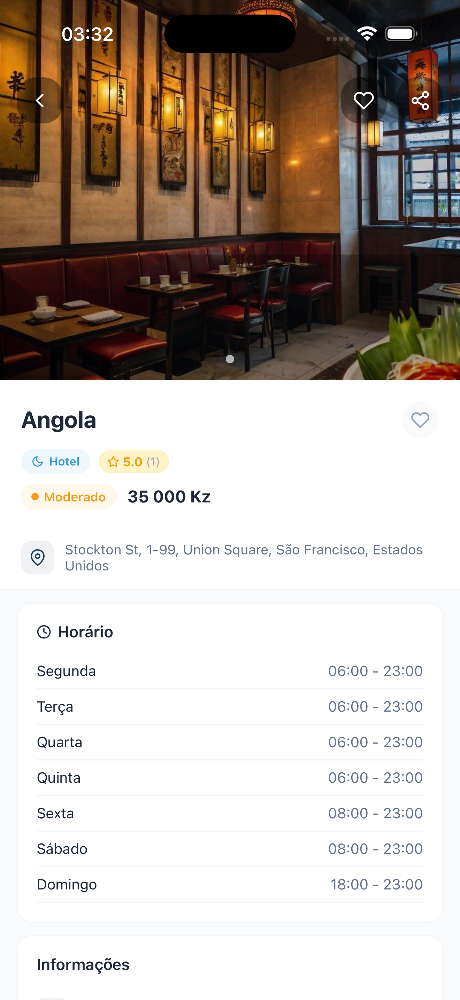
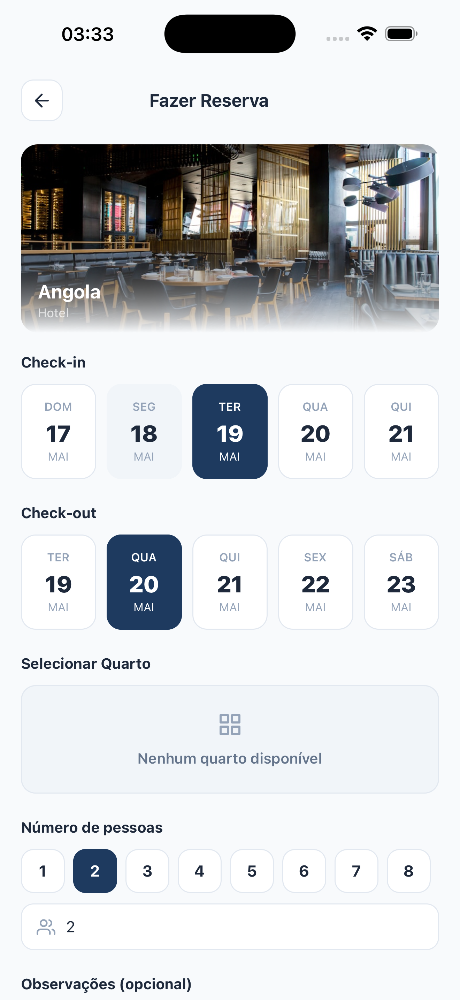
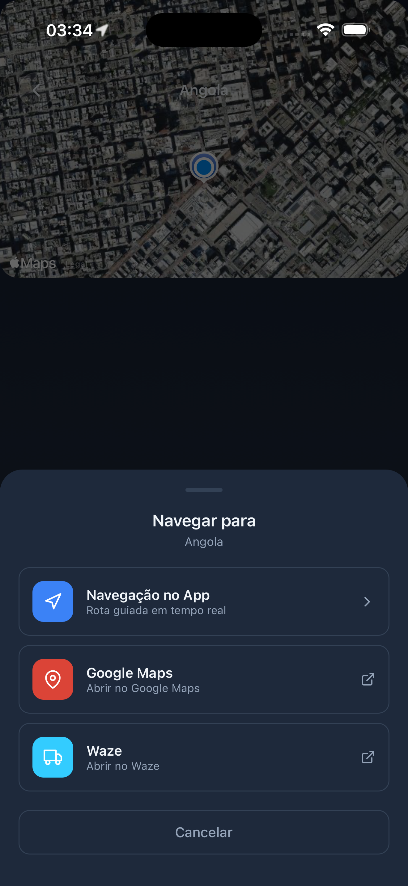
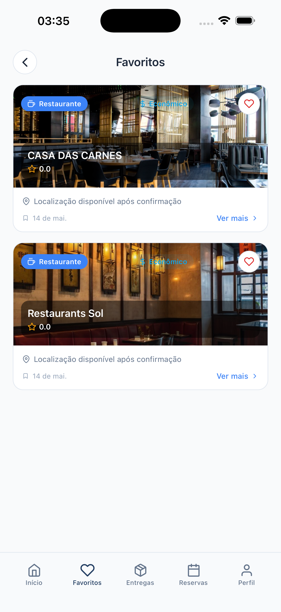

  

  <samp>Descubra os melhores lugares de Angola — Restaurantes, hotéis, resorts e discotecas. Tudo num só lugar.</samp>

 

  <a href="https://caop-b.com"><code>caop-b.com</code></a>
  &nbsp;&nbsp;▸&nbsp;&nbsp;
  <a href="#screenshots"><code>Screenshots</code></a>
  &nbsp;&nbsp;▸&nbsp;&nbsp;
  <a href="#about"><code>Sobre</code></a>
  &nbsp;&nbsp;▸&nbsp;&nbsp;
  <a href="#features"><code>Funcionalidades</code></a>
  &nbsp;&nbsp;▸&nbsp;&nbsp;
  <a href="#download"><code>Download</code></a>

 

  
  
  
  

 

 

<h2 id="screenshots">Screenshots</h2>

  Explore o aplicativo através das telas principais.

 

<table>
  <tr>
    <td align="center" width="25%">
      
       <b>Boas-vindas</b>
    </td>
    <td align="center" width="25%">
      
       <b>Página Inicial</b>
    </td>
    <td align="center" width="25%">
      
       <b>Explorar</b>
    </td>
    <td align="center" width="25%">
      
       <b>Detalhes do Lugar</b>
    </td>
  </tr>
  <tr>
    <td align="center" width="25%">
      
       <b>Reservas</b>
    </td>
    <td align="center" width="25%">
      
       <b>Mapa Interativo</b>
    </td>
    <td align="center" width="25%">
      
       <b>Favoritos</b>
    </td>
    <td align="center" width="25%">
      
       <b>Painel do Agente</b>
    </td>
  </tr>
</table>

  <a href="screenshots-guide.md">Guia para capturar e adicionar as imagens →</a>

 

 

<h2 id="about">Sobre o CAOP-B</h2>

 

<table>
  <tr>
    <td width="55%" valign="top">
      

        Angola possui uma riqueza gastronómica, cultural e turística imensa. No entanto, descobrir os melhores restaurantes, discotecas, hotéis e resorts, comparar opções, fazer reservas ou pedir comida ainda era um processo fragmentado e sem confiança.
      

      

        O <strong>CAOP-B</strong> nasceu para resolver esse problema. Somos a primeira plataforma angolana que unifica descoberta, reservas, pedidos e gestão de estabelecimentos num único ecossistema digital.
      

      

        Para os <strong>utilizadores</strong>, oferecemos uma experiência completa: explore lugares com recomendações inteligentes, visualize no mapa com navegação passo-a-passo, faça reservas em segundos, peça comida e acompanhe a entrega em tempo real — tudo dentro do mesmo aplicativo.
      

      

        Para os <strong>agentes</strong> (proprietários de estabelecimentos), disponibilizamos ferramentas profissionais de gestão: dashboard com métricas, controlo de reservas, analytics de desempenho, gestão de menu e entregas, e respostas a avaliações.
      

      

        O resultado é um mercado mais eficiente para Angola: mais clientes para os estabelecimentos, melhor experiência para os utilizadores e mais transparência para todos.
      

    </td>
    <td width="45%" valign="top" align="center">
      
        
      
        
      
    </td>
  </tr>
</table>

 

 

<h2 id="features">Funcionalidades</h2>

 

<h3>Para Utilizadores</h3>

 

<table>
  <tr>
    <td width="50%" valign="top">
      

        
        <b>Descoberta Inteligente</b> 
        Explore restaurantes, discotecas, hotéis e resorts com recomendações personalizadas baseadas nas tuas preferências e orçamento.
      

    </td>
    <td width="50%" valign="top">
      

        
        <b>Filtro por Orçamento</b> 
        Define o teu orçamento em Kz e descobre lugares que cabem no teu bolso.
      

    </td>
  </tr>
  <tr>
    <td width="50%" valign="top">
      

        
        <b>Mapa com Navegação</b> 
        Visualiza todos os lugares no mapa com marcadores interativos e navegação passo-a-passo até ao destino.
      

    </td>
    <td width="50%" valign="top">
      

        
        <b>Reservas</b> 
        Faz reservas em segundos: escolhe data, horário e número de pessoas. Confirmação automática.
      

    </td>
  </tr>
  <tr>
    <td width="50%" valign="top">
      

        
        <b>Menu e Pedidos</b> 
        Vê o menu completo, faz pedidos e acompanha a entrega em tempo real.
      

    </td>
    <td width="50%" valign="top">
      

        
        <b>Avaliações</b> 
        Lê avaliações reais de outros utilizadores e partilha a tua experiência.
      

    </td>
  </tr>
  <tr>
    <td width="50%" valign="top">
      

        
        <b>Favoritos</b> 
        Salva os teus lugares preferidos e recebe notificações de promoções.
      

    </td>
    <td width="50%" valign="top">
      

        
        <b>Notificações</b> 
        Recebe atualizações de reservas, entregas, avaliações e promoções.
      

    </td>
  </tr>
</table>

 

<h3>Para Agentes (Estabelecimentos)</h3>

 

<table>
  <tr>
    <td width="50%" valign="top">
      

        
        <b>Dashboard Completo</b> 
        Acompanha reservas, faturação, avaliações e lugares ativos em tempo real.
      

    </td>
    <td width="50%" valign="top">
      

        
        <b>Gestão de Reservas</b> 
        Administra todas as reservas recebidas com calendário completo.
      

    </td>
  </tr>
  <tr>
    <td width="50%" valign="top">
      

        
        <b>Analytics</b> 
        Estatísticas detalhadas sobre o desempenho do negócio.
      

    </td>
    <td width="50%" valign="top">
      

        
        <b>Gestão de Entregas</b> 
        Configura zonas de entrega e acompanha pedidos em tempo real.
      

    </td>
  </tr>
  <tr>
    <td width="50%" valign="top">
      

        
        <b>Gestão de Menu</b> 
        Cria e edita itens do menu com preços, fotos e categorias.
      

    </td>
    <td width="50%" valign="top">
      

        
        <b>Avaliações</b> 
        Responde publicamente às avaliações e constrói a reputação do negócio.
      

    </td>
  </tr>
</table>

 

 

<h2 id="download">Download</h2>

 

  O aplicativo CAOP-B está disponível para iOS, Android e Web.

 

  

 

 

  
   
  <strong>CAOP-B</strong> — Tecnologia que conecta Angola.
   
  <a href="https://caop-b.com">caop-b.com</a>
   
  &copy; 2025 CAOP-B. Todos os direitos reservados.

